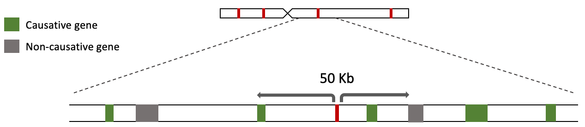
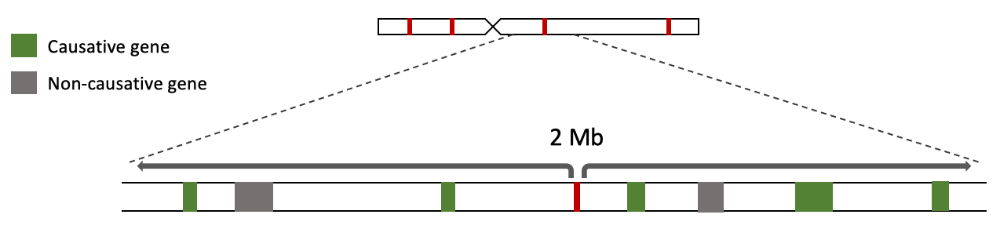
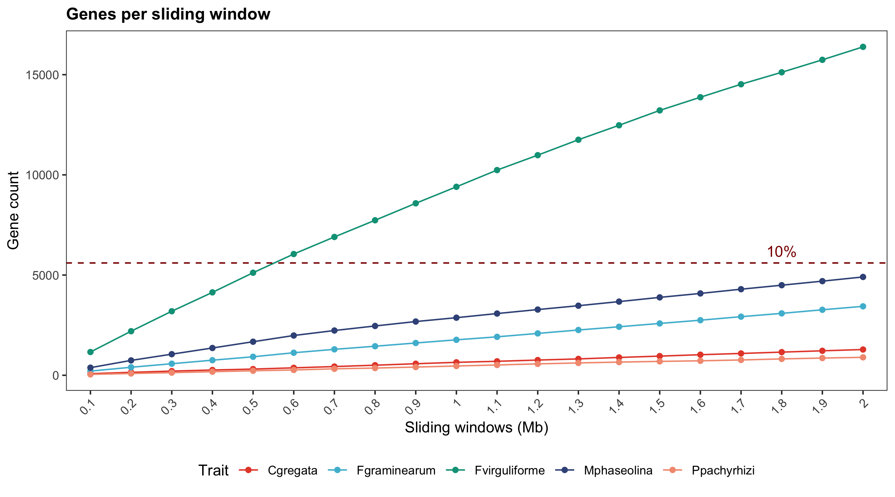
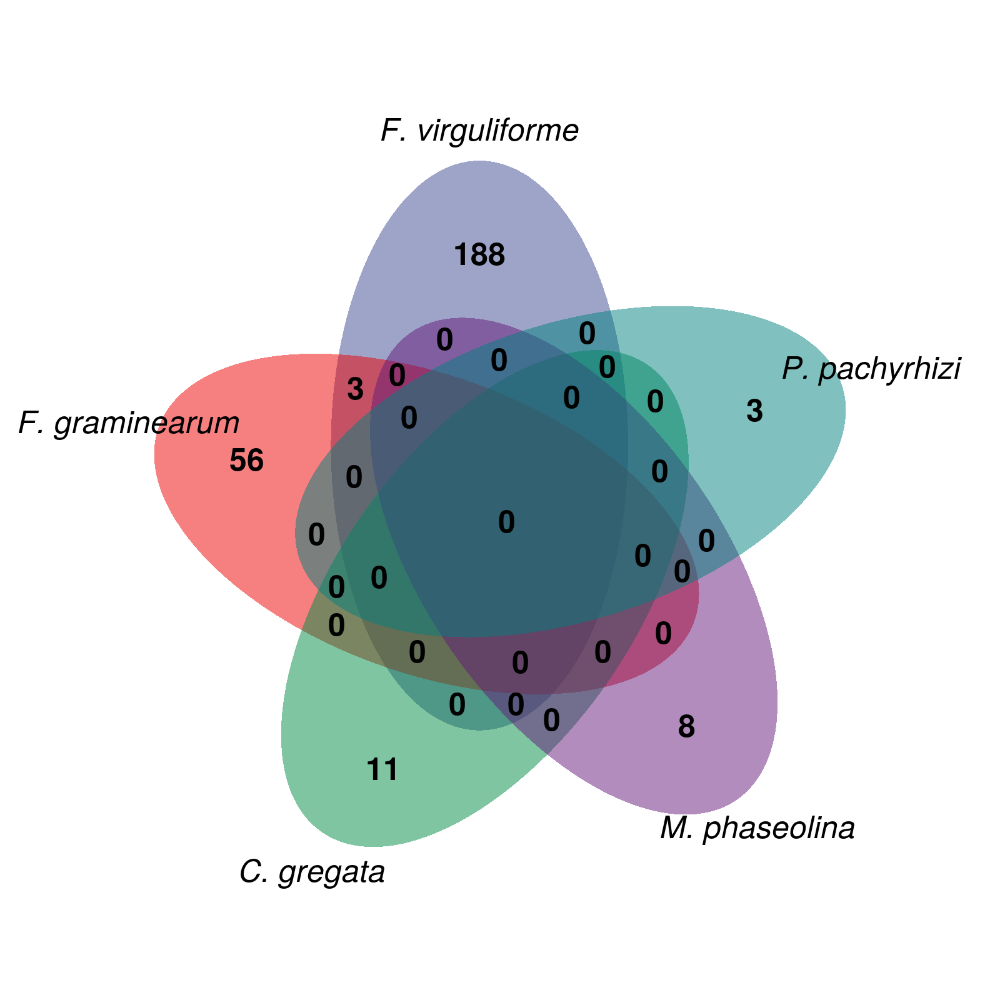
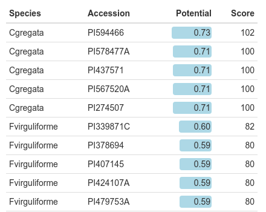
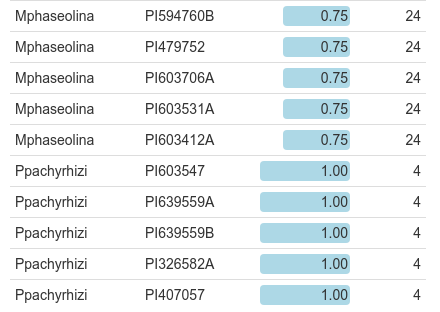

```{r setup, include=FALSE}
knitr::opts_chunk$set(
  warning = FALSE, 
  message = FALSE,
  echo = FALSE,
  fig.width = 7, fig.height = 2.5
)
options(htmltools.dir.version = TRUE)
```

```{r panels, echo=FALSE}
xaringanExtra::use_panelset()
```

```{r xaringan-webcam, include = FALSE}
xaringanExtra::use_webcam()
```

background-image: url(figs/intro1.png)
background-position: 95% 50%
background-size: 45%

## Introdução

<br />

.pull-left[
Soja e economia: 2% do PIB .font80[(EMBRAPA, 2019)]


Bilhões de dólares gastos anualmente no controle de doenças .font80[(Osman et al., 2015)]
]

---

background-image: url(https://www.researchgate.net/profile/Martin-Heil-2/publication/258202582/figure/fig7/AS:271915302518812@1441841068064/Examples-of-common-fungal-diseases-of-plants-a-Rust-on-flax-Linum-usitatissimum-C_Q640.jpg)
background-position: 95% 50%
background-size: 45%

## Introdução

<br />

.pull-left[
Soja e economia: 2% do PIB .font80[(EMBRAPA, 2019)]

Bilhões de dólares gastos anualmente no controle de doenças .font80[(Osman et al., 2015)]

**Fungos fitopatogênicos** -  Perda de produtividade por:

1. Lesão foliar

2. Apodrescimento de raízes

3. Danos a sementes

4. Morte

Agenda 2030: aumento sustentável da produtividade

.footnote[García-Guzmán *et al.*, 2013]

]

---

## O problema de pesquisa

<br />

GWAS identificaram **SNPs causais** relacionados a resistência a doenças fúngicas, mas não **genes causais**.

Métodos atuais resultam em altas taxas de falso-positivos e falso-negativos.

<br />

```{r}

```

**Problema:** muitos falso-negativos

---

## O problema de pesquisa

<br />

GWAS identificaram **SNPs causais** relacionados a resistência a doenças fúngicas, mas não **genes causais**.

Métodos atuais resultam em altas taxas de falso-positivos e falso-negativos.

<br />

```{r}

```

**Problema:** muitos falso-positivos

---

## A possível solução

<br />

Vértices representam genes e arestas representam os coeficientes de correlação entre eles.

```{r echo=FALSE, out.width='75%', fig.align='center'}
knitr::include_graphics("figs/redes_example1.png")
```

Em larga escala, é possível detectar **módulos** de genes com funções similares.

---

## Objetivo

<br />
.center[.font120[Identificar genes de soja relacionados à resistência a doenças fúngicas comuns a partir da integração de GWAS e redes de coexpressão gênica]]

---

background-image: url(figs/project_workflow.png)
background-size: 100%
background-position: 50% 30%

## Metodologia

---

background-image: url(figs/package_logos.png)
background-position: 95% 50%
background-size: 40%

## Desenvolvimento de softwares


.pull-left[
.brand-charcoal[.font130[.bold[BioNERO:]]]

Pacote do R destinado a:
- pré-processamento de dados de expressão
- inferência de redes de coexpressão gênica
- análises funcionais.

<br/ >
.brand-charcoal[.font130[.bold[cageminer:]]]

Pacote do R destinado a: 
- integrar GWAS e redes de coexpressão para priorizar genes candidatos 

]

---

background-image: url(figs/frequency_of_snps_and_transcriptome_samples_overlap.png)
background-position: 95% 50%
background-size: 45% 90%


## Descrição dos dados

<br />

.pull-left[
.brand-charcoal[.font130[.bold[Critério de filtragem:]]]

Uma espécie deve ser representada por: 
- amostras de transcriptoma
- SNPs significativos
]

---

background-image: url(https://crop-protection-network.s3.amazonaws.com/articles/BSR-foliar-and-stem-symptoms-A.-sisson.jpg)
background-position: 95% 50%
background-size: 40%

## Descrição dos dados

.pull-left[
5 fungos fitopatogênicos comuns:

- *Cadophora gregata:* causador da podridão parda da haste da soja

.footnote[Fonte: Crop Protection Network]
]

---

background-image: url(https://bsppjournals.onlinelibrary.wiley.com/cms/asset/df052881-7bbb-4915-9a88-c4b74a28c9b4/ppa12532-fig-0001-m.jpg)
background-position: 95% 50%
background-size: 40%

## Descrição dos dados

.pull-left[
5 fungos fitopatogênicos comuns:

- *Cadophora gregata:* causador da podridão parda da haste da soja

- *Fusarium graminearum:* causador da fusariose

.footnote[Chiotta *et al.*, 2016]
]

---

background-image: url(https://bugwoodcloud.org/images/768x512/5465755.jpg)
background-position: 95% 50%
background-size: 40%

## Descrição dos dados

.pull-left[
5 fungos fitopatogênicos comuns:

- *Cadophora gregata:* causador da podridão parda da haste da soja

- *Fusarium graminearum:* causador da fusariose

- *Fusarium virguliforme:* causador da síndrome da morte súbita

.footnote[Fonte: Daren Mueller]
]

---

background-image: url(https://phytus.s3.amazonaws.com/apps/clubephytus-api/midia/a/5fcdcbb8/thumbnail.jpg)
background-position: 95% 50%
background-size: 40%

## Descrição dos dados

.pull-left[
5 fungos fitopatogênicos comuns:

- *Cadophora gregata:* causador da podridão parda da haste da soja

- *Fusarium graminearum:* causador da fusariose

- *Fusarium virguliforme:* causador da síndrome da morte súbita

- *Macrophomina phaseolina:* causador da podridão de carvão

.footnote[Fonte: Elevagro]
]

---

background-image: url(https://www.agrolink.com.br/upload/problemas/Phakopsora_pachyrhizi57.jpg)
background-position: 95% 50%
background-size: 40%

## Descrição dos dados

.pull-left[
5 fungos fitopatogênicos comuns:

- *Cadophora gregata:* causador da podridão parda da haste da soja

- *Fusarium graminearum:* causador da fusariose

- *Fusarium virguliforme:* causador da síndrome da morte súbita

- *Macrophomina phaseolina:* causador da podridão de carvão

- *Phakopsora pachyrhizi:* causador da ferrugem asiática

.footnote[Fonte: Agrolink]
]

---


## Extração de genes candidatos

<br />

```{r all_cand, out.width='900px', out.height='500px', fig.align='center'}

```

---

## Priorização de genes candidatos

```{r workflow_cageminer, echo=FALSE}
knitr::include_graphics("figs/workflow.png")
```

---

## Priorização de genes candidatos

.pull-left[

<br />

- *Cadophora gregata:* **11** 

- *Fusarium graminearum:* **59** 

- *Fusarium virguliforme:* **191** 

- *Macrophomina phaseolina:* **8** 

- *Phakopsora pachyrhizi:* **3** 

Defesa **altamente espécie-específica**

]

.pull-right[
```{r venn, echo=FALSE}

```
]

---

## Seleção de genes mais promissores

<br />
Atribuição de *scores* aos genes candidatos priorizados:

.font140[
$$S_i = r_{pb} \kappa$$
] 

.center[
onde:

$\kappa$ = 2 se o gene for um fator de transcrição

$\kappa$ = 2 se o gene for um *hub* (muito conectado)

$\kappa$ = 3 se o gene for um fator de transcrição e um *hub*

]

---

background-image: url(figs/biorender_figure.png)
background-size: 85% 85%
background-position: 50% 90%

.center[
.red[*C. gregata*] &nbsp;&nbsp;&nbsp;&nbsp;&nbsp;
.blue[*F. graminearum*] &nbsp;&nbsp;&nbsp;&nbsp;&nbsp;
.brown[*F. virguliforme*] &nbsp;&nbsp;&nbsp;&nbsp;&nbsp;
.green[*M. phaseolina*] &nbsp;&nbsp;&nbsp;&nbsp;&nbsp;
.purple[*P. pachyrhizi*]
]

---

## Seleção de cultivares de interesse

<br />

```{r cultivares, echo=FALSE, warning=FALSE, eval=FALSE}
suppressPackageStartupMessages(library(formattable))
acc <- read.csv("data/best_accessions_and_potential.txt", sep="\t")
acc2 <- acc[, c(4,1,3,2)]
acc2$Potential <- round(acc2$Potential, 2)
acc2$Score <- round(acc2$Score, 2)
formattable(acc2, 
            align = c("l", "l", "r", "r"),
            list(
              Potential = color_bar("lightblue")
              )
            )
``` 

.pull-left[
``` {r echo=FALSE, fig.align='right'}

```
]

.pull-right[
``` {r echo=FALSE, fig.align='left'}

```

]

Ainda há espaço para piramidar alelos de resistência via MAS ou edição genômica

---

background-image: url(http://www.mcgilltribune.com/wp-content/uploads/2019/11/gene_editing.jpg)
background-position: 95% 50%
background-size: 40%

## Conclusão

.pull-left[
Identificamos genes candidatos promissores para desenvolver plantas de soja resistentes a 5 fungos fitopagênicos comuns por:

- Edição genômica

- Transgenia

.footnote[Fonte: The McGill Tribune]

]

---

background-image: url(https://www.agroscope.admin.ch/agroscope/en/home/topics/plant-production/plant-breeding/ackerpflanzen/selection_soja/_jcr_content/par/columncontrols/items/1/column/image/image.imagespooler.jpg/1473888418017/selection_soja_fleur.jpg)
background-position: 95% 50%
background-size: 40%

## Conclusão

.pull-left[
Identificamos genes candidatos promissores para desenvolver plantas de soja resistentes a 5 fungos fitopagênicos comuns por:

- Edição genômica

- Transgenia

Identificamos acessos mais resistentes do banco de germoplasma do USDA que podem ser usados como genitores em programas de melhoramento;

.footnote[Fonte: Agroscope]
]

---

background-image: url(figs/package_logos.png)
background-position: 95% 50%
background-size: 40%

## Conclusão

.pull-left[
Identificamos genes candidatos promissores para desenvolver plantas de soja resistentes a 5 fungos fitopagênicos comuns por:

- Edição genômica

- Transgenia

Identificamos acessos mais resistentes do banco de germoplasma do USDA que podem ser usados como genitores em programas de melhoramento;


Desenvolvemos 2 produtos (pacotes do R) que podem ser usados pela comunidade científica.
]
